<div align="center">
  
</div>

# Bi83-kit 🚀

**The Official Plugin Development Kit (SDK) for the Bismuth Emulator.**

[](https://www.rust-lang.org)
[](https://webassembly.org/)

`Bi83-kit` is a powerful, zero-cost, and developer-friendly Rust SDK designed to build extremely fast WebAssembly plugins for the Bismuth Emulator. It hides all the complex FFI (Foreign Function Interface), memory allocations, and `unsafe` code behind a single elegant trait and macro.

## 🌟 Why Bi83-kit?

- **Zero-Cost Abstractions**: Reads directly from emulator memory using `bytemuck` without any parsing overhead (no JSON!).
- **Safe & Simple API**: No need to manage WebAssembly linear memory manually. Just implement the `Plugin` trait.
- **Lightning Fast**: Compiles straight to minimal WASM, resulting in native-level plugin speeds.

---

## 📦 Getting Started

### 1. Create a New Plugin Project

Create a new Rust library project:

```bash
cargo new --lib my_bi83_plugin
cd my_bi83_plugin
```

Configure your `Cargo.toml` to compile to a dynamic C-compatible WASM library:

```toml
[package]
name = "my_bi83_plugin"
version = "0.1.0"
edition = "2021"

[lib]
crate-type = ["cdylib"]

Run the following command to automatically configure your `Cargo.toml` with the latest version from GitHub:

```bash
cargo add bi83-kit --git https://github.com/badralslmy/bi83-kit
```

*Alternatively, manually add this to your `Cargo.toml`:*
```toml
[dependencies]
bi83-kit = { git = "https://github.com/badralslmy/bi83-kit", branch = "main" }
```

### 2. Write Your Plugin

Open `src/lib.rs` and implement the `Plugin` trait:

```rust
use bi83_kit::{Plugin, EmulatorState, export_plugin, log, read_ram, write_ram, draw_rect};

struct MyAwesomePlugin;

impl Plugin for MyAwesomePlugin {
    fn init() {
        // Called once when the plugin is loaded
        log("MyAwesomePlugin has successfully initialized in the Bismuth Emulator!");
    }

    fn update(state: &mut EmulatorState) {
        // 1. You can freely read and mutate the state! (Input Injection)
        if state.frame_count % 60 == 0 {
             state.keys = 0xFF; // Simulate pressing all buttons!
        }
        
        // 2. You can read and write to the Emulator's RAM directly
        let player_hp = read_ram(0x4000);
        if player_hp == 0 {
             write_ram(0x4000, 100); // Infinite health cheat!
        }

        // 3. You can draw overlays on the screen
        // Draw a green square at (10, 10) size 50x50
        draw_rect(10, 10, 50, 50, 0x00FF00FF);
    }
}

// Automatically exports all necessary FFI to WASM
export_plugin!(MyAwesomePlugin);
```

### 3. Build Your Plugin

Compile your plugin into a `.wasm` file using the `wasm32-unknown-unknown` target:

```bash
cargo build --target wasm32-unknown-unknown --release
```

Your compiled plugin will be available at:
`target/wasm32-unknown-unknown/release/my_bi83_plugin.wasm`

Load this file into the Bismuth Emulator and watch the magic happen! 🚀

---

## 🛠️ API Reference

### `EmulatorState` (Mutable)
The exact state of the emulator on the current frame. Passed to `update(state: &mut EmulatorState)`. Because it is mutable, modifying it allows you to inject inputs back into the emulator!
```rust
pub struct EmulatorState {
    pub delta_time: f32, // Time passed since last frame
    pub frame_count: u32, // Total frames processed
    pub keys: u32,       // Bitmask of active keyboard keys (Mutable for Input Injection)
}
```

### Advanced Hooks
- `log(msg: &str)`: Safely passes a string message back to the emulator's host console.
- `read_ram(address: u32) -> u8`: Reads a byte directly from the emulator's memory space.
- `write_ram(address: u32, value: u8)`: Writes a byte to the emulator's memory space.
- `draw_rect(x: u32, y: u32, w: u32, h: u32, color: u32)`: Requests the host renderer to draw a rectangle overlay. Color format is `0xRRGGBBAA`.
- `http_request_async(url: &str, method: &str, headers: &str, body: Option<&[u8]>) -> u32`: Initiates a non-blocking asynchronous HTTP request.
- `http_poll_response(req_id: u32) -> Option<Result<Vec<u8>, String>>`: Polls an async HTTP request status.
- `ui_inject_html(id: &str, html: &str)`: Injects raw HTML into the Bismuth Emulator's Tauri-based web frontend.
- `ui_remove_html(id: &str)`: Removes previously injected HTML by its ID.
- `ui_notify(title: &str, body: &str)`: Triggers a notification in the Bismuth Emulator UI.
- `storage_read(key: &str) -> Option<String>`: Reads a value from the plugin's isolated persistent storage.
- `storage_write(key: &str, value: &str)`: Writes a value to the plugin's isolated persistent storage.
- `storage_read_bin(key: &str) -> Option<Vec<u8>>`: Reads a binary payload (e.g. image bytes) from the plugin's persistent storage.
- `storage_write_bin(key: &str, value: &[u8])`: Writes binary data to the plugin's persistent storage.
- `is_key_pressed(keycode: u32) -> bool`: Checks if a specific physical key is currently pressed.

📚 **For a complete list of APIs and advanced usage, read the [API Documentation](docs/API.md).**

🤖 **Are you an AI Agent writing a plugin? Read the [AI Instructions](docs/AI-INSTRUCTIONS.md) first!**

---

## 🚀 Publishing (For the Author)

To publish this kit to `crates.io` so developers can use it as a standard dependency:
1. Ensure your `Cargo.toml` is correctly configured with `license`, `description`, etc.
2. Login to `crates.io` via terminal: `cargo login <YOUR_TOKEN>`
3. Run `cargo publish` inside the `bi83-kit` directory!
